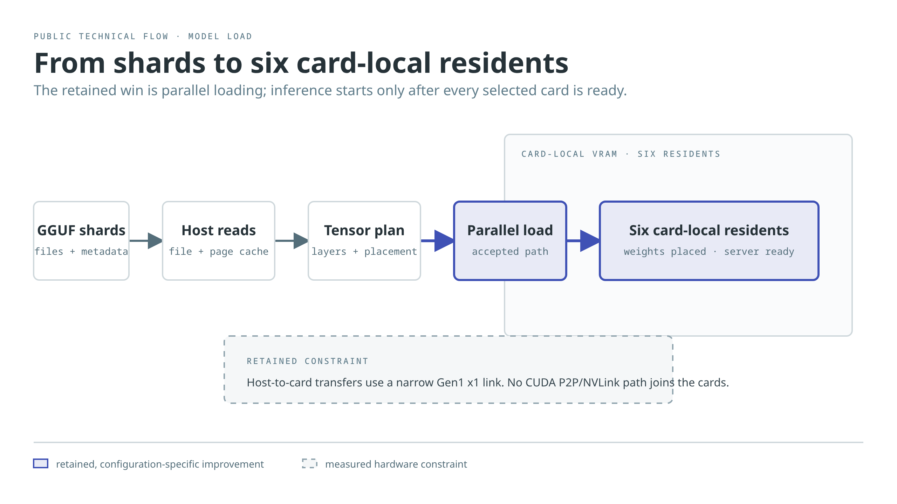
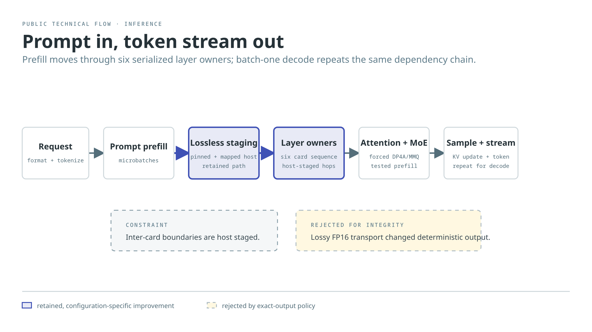

# CMP100-210 llama.cpp Research

> **WORK IN PROGRESS — EXPERIMENTAL RESEARCH — NO CLAIMS, WARRANTIES, OR GUARANTEES.**

This portal presents a deliberately small, reviewable record of experimental
llama.cpp work on a six-card CMP100-210 configuration. It is not a hardware
ranking, a V100 comparison, a firmware guide, or a promise that a result will
transfer to another model or host.

Start with [Methodology](methodology.md) and [Hardware Limitations](hardware-limitations.md).
The [Findings](findings/accepted-optimizations.md) retain negative evidence as
well as accepted configuration-specific results.

The [Source patches](source-release.md) page documents the pinned upstream
base, complete-hunk series, transactional application gate, and native-SM70
build boundary.

## How to read a result

A result is only comparable when the model, quantization, request shape,
selected-card clocks, binary, and output-integrity policy match. Performance
is evaluated together with PCIe traffic, server-process CPU time, GPU work
where available, and memory pressure; a local kernel improvement is not treated
as a user-visible win until it survives a complete request.

## System diagrams

### Model loading

[Open the editable diagram source](assets/diagrams/cmp-model-load-path.html).

### Inference flow

[Open the editable diagram source](assets/diagrams/cmp-request-token-flow.html).
